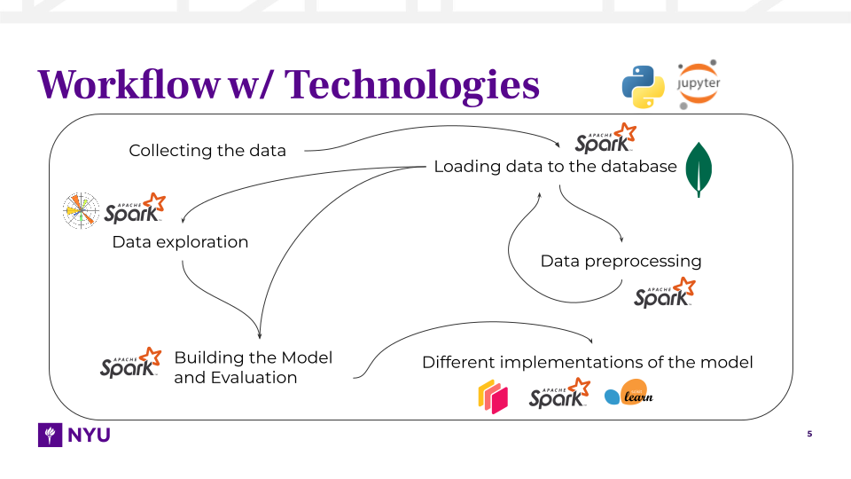

# nyc-taxi-fare-prediction

Course Project for CS-GY 6513 Big Data

## Description

The aim of this project is to predict the fare for taxis in New York City (NYC) using large-scale data processing technologies. The project involves collecting the NYC taxi dataset, pre-processing the data, storing it in MongoDB, performing exploratory data analysis (EDA), building a predictive model using Spark and Python, evaluating the model's performance, scaling the computations using Dask, and visualizing the findings using Matplotlib and Seaborn.

## Workflow & Technologies



## Why is this a Big Data problem?

The prediction of NYC Taxi Fare is a Big Data problem primarily due to the large volume of data involved, including structured and unstructured data, such as pickup and dropoff locations, timestamps, and weather conditions. The dataset is continuously growing, requiring real-time or near-real-time processing and analysis for accurate predictions. Additionally, the integration of multi-source data, such as weather data, public events, transportation schedules, social media, and traffic data, increases the complexity and variety of the data.

One of the major challenges in this problem is scaling the computations to handle the immense volume of data effectively. Traditional data processing techniques may struggle to cope with the computational demands of such a large dataset, necessitating the use of distributed computing technologies like Hadoop, Spark, and Dask. These technologies distribute the data and processing tasks across multiple machines, allowing for faster and more efficient processing while highlighting the Big Data aspect of the NYC Taxi Fare Prediction problem.

## Setup

Install Python dependencies (includes Jupyter Notebook, PySpark, and Dask)
```bash
mkdir .venv && python3 -m venv .venv
python3 -m pip install -r requirements.txt
```

References
- [Installation - PySpark](https://spark.apache.org/docs/latest/api/python/getting_started/install.html)
- [Dask Installation - Dask Documentation](https://docs.dask.org/en/stable/install.html)
- [Project Jupyter - Installing Jupyter](https://jupyter.org/install)

Install MongoDB
```bash
brew tap mongodb/brew
brew update
brew install mongodb-community@4.2
```

Read [Install MongoDB Community Edition on macOS - MongoDB Manual](https://www.mongodb.com/docs/v4.2/tutorial/install-mongodb-on-os-x/)

## Usage

Jupyter Notebook
```bash
jupyter notebook
```

MongoDB
```bash
brew services start mongodb-community@4.2
```

## Dataset

https://www.nyc.gov/site/tlc/about/tlc-trip-record-data.page
```bash
cd code
python3 download-yellow-taxi-data.py
```
This script downloads the NYC Yellow Taxi data available from January 2009 to now and stores it in the `data` directory.

## Technologies

* [Python](https://www.python.org/)
* [Jupyter Notebook](https://jupyter.org/)
* [MongoDB](https://www.mongodb.com/)
* [PySpark](https://spark.apache.org/docs/latest/api/python/index.html)
* [Dask](https://dask.org/)
* [Matplotlib](https://matplotlib.org/)
* [scikit-learn](https://scikit-learn.org/stable/)

## Team

Sye!
1. [Jaswanth Sai Nandipati](https://github.com/Jaswanth72) - jn2652@nyu.edu
2. [Sai Teja Reddy Parigi](https://github.com/ParigiSaiTeja) - sp6923@nyu.edu
3. [Venu Vardhan Reddy Tekula](https://github.com/vchrombie) - vt2182@nyu.edu
